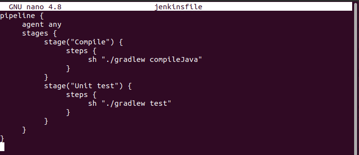
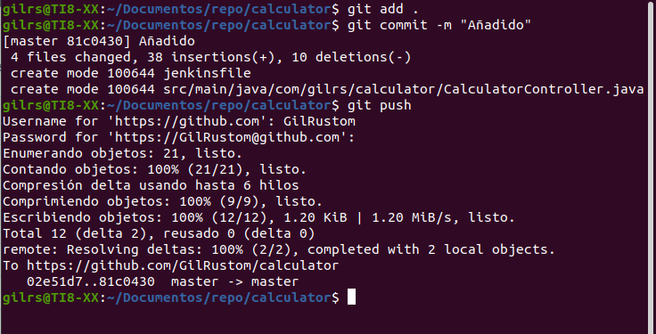
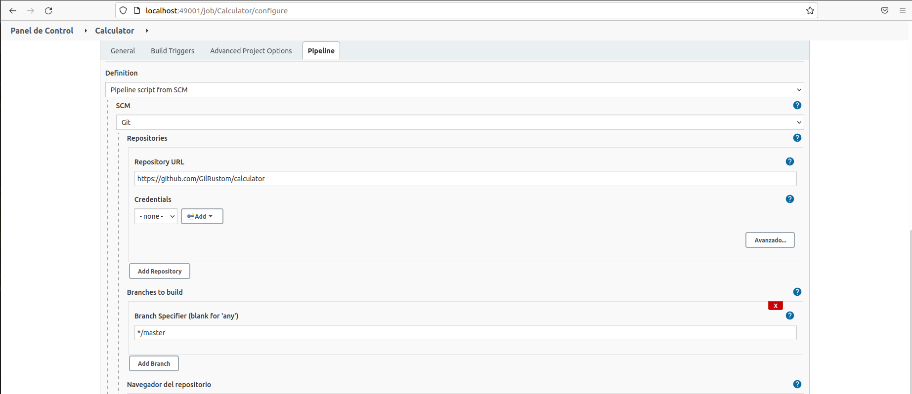

# Jenkinsfile

------

Hasta ahora se esta creando el código de la pipeline directamente en Jenkins. Sin embargo,  esta no es la única opción. También se puede poner la definición de la  pipeline dentro de un archivo llamado Jenkinsfile y enviarlo al  repositorio junto con el código fuente. 

## Crear el archivo Jenkinsfile

A continuación, se crea el archivo Jenkins y se envia al repositorio de GitHub. Su  contenido es casi el mismo que el canal de confirmación. La única diferencia es que la etapa de verificación se vuelve redundante porque Jenkins primero tiene que verificar el código (junto con  Jenkinsfile) y luego leer la estructura de canalización.

Ahora se crea el archivo jenkinsfile en el directorio raiz del proyecto:



Se suben los cambios al repositorio, para ello se ejecutan los siguientes comandos:

```
git add . 
git commit -m "Añadido Jenkinsfile" 
git push
```



En el siguiente enlace se puede ver que se ha añadido el archivo jenkinsfile al repositorio:

https://github.com/GilRustom/calculator

## Ejecutar la pipeline con Jenkinsfile

Cuando Jenkinsfile está en el repositorio, todo lo que thay que hacer es abrir la configuración de la pipeline y en la sección Pipeline:

Cambiar definición de secuencia `pipeline script` a  `pipeline script from SCM`

- Seleccionar Git en SCM
- Poner https://github.com/GilRustom/calculator.git en la URL del repositorio

El resultado debe ser parecido al que aparece en la siguiente imagen:




NOTA: a partir de aqui ya no se ha podido acabar la práctica ya que en el portal de jenkins da errores a la hora de seguir con los pasos para hacer la práctica.


