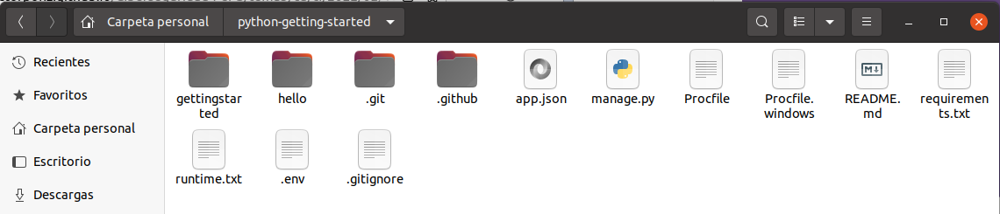

## Heroku

## Introducción

Es una plataforma de computación en la nube que soporta distintoa lenguajes de programación.

## Instalación

Antes de empezar hay que darse de alta en Heroku para elegir el nivel gratuito, para ello se instala el cli mediante el comando sudo snap install heroku --classic:


A continuación, se logea mediante la consola:


## Preparar la aplicación

Se procede a clonar la aplicación de ejemplo para ello se ejecuta el comando: 

```
git clone https://github.com/heroku/python-getting-started.git
cd python-getting-started
```


Ahora se ha creado un repositorio git funcionando que contiene una aplicación simple:



## Desplegar la aplicación

Se procede a crear una aplicación en Heroku para recibir el código fuente:


A continuación, se desplega el código:


Ahora la aplicación ya está desplegada en https://whispering-plains-98217.herokuapp.com


## Escalar la aplicación

En este momento, la aplicación se ejecuta en un único banco de pruebas web dynos que es un contenedor ligero que ejecuta el comando especificado en el procfile. Este archivo comunica a heroku el orden en el que debe ejecutarse para lanzar la aplicación:


Se puede verificar cuántos dynos se están ejecutando:


## Instalación de las dependencias de la aplicación localmente

Para poder instalar las dependencias localmente, primero se crear un entorno virtual  en el que se instalarán los paquetes  sin afectar la instalación de Python en su sistema. Para ello se instala el entorno virtual de python mediante `sudo apt install python3.8-venv`  y luego se crea un nuevo entorno virtual:


La instalación de las dependencias también provocó la instalación de  varias otras dependencias. Para verlas se  usa la lista de funciones  de pip:


## Ejecutar la aplicación de forma local

Se ejecuta collectatic:


A continuación, se ejecuta la aplicación:


## Subir cambios locales

En este apartado se procede a propagar un cambio local a la aplicación a través de Heroku:

- Agregar el paquete requests al archivo requirements.txt

  

- Se actualizan las dependencias:

  

- Se modifica hello/views.py para que importe el módulo requests al principio y tambien se modifica el método index:

  

Ahora se lanza la aplicación en local : 


A continuación, se procede a subir los cambios al repositorio de Heroku:


Ahora se comprueba que todo funciona para ello se ejecuta el comando heroku open:


## Aprovisionar una base de datos

Para saber que complementos hay instalados se ejecuta el comando heroku addons:


Y para comprobar la cadena de conexión que muestra la url que la aplicación usa para conectarse a la base de datos se ejecuta el comando heroku config:


Para obtener más información sobre la conexión, se ejecuta el comando heroku pg:


La aplicación de ejemplo que se ha implementado ya tiene funcionalidad de base de datos, a la que se puede  acceder visitando la URL de la  aplicación y agregando `/db`:


------------

-------------

-----------------

