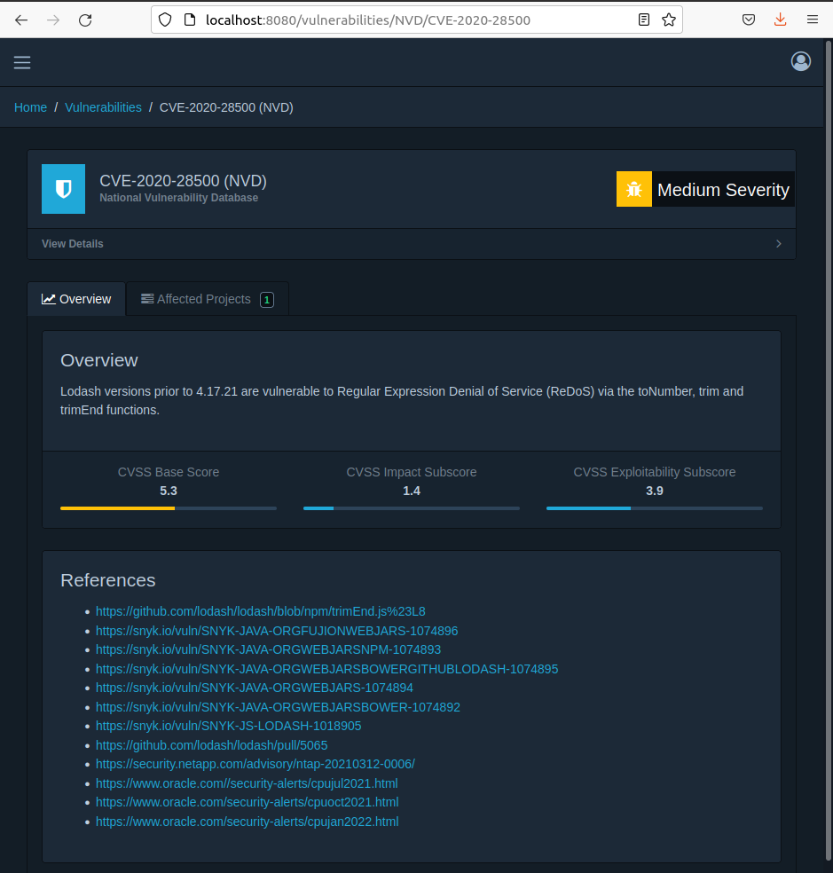

## DependencyTrack

Es un proyecto de la OWASP que permite una gestión de las dependencias y de sus vulnerabilidades.

## 1. Instalación

Para la instalación se ejecuta el comando 

```
curl -LO https://dependencytrack.org/docker-compose.yml
```


Ahora se levanta el servicio, para ello se ejecuta el comando 

```
docker-compose up -d
```


# 2. Crear un proyecto

Una vez instalado y funcionando, se crear un proyecto y se carga un archivo `bom.xml` que es un formato estándar para especificar Bill Of Materials:


# 3. Cargar uno de los ejemplos propuestos

Se procede a cargar uno de los ejemplos propuestos, en este caso es:


Ahora se sube mediante el bóton Upload BOM

# 4. Ordenar las vulnerabilidades de mayor a menor

A continuación, se procede a ordenar las vulnerabilidades de mayor a menor:


# 5. Mostrar la información de una de las vulnerabilidades

Si se accede por ejemplo a la de lodash y en vulnerabilidades alli se puede ver todas las vulnerabilidades encontradas:


Ahora por ejemplo si se hace click en una de las vulnerabilidades encontradas se muestra más información de esa vulnerabilidad seleccionada:




-----------------

--------------------

----------------

