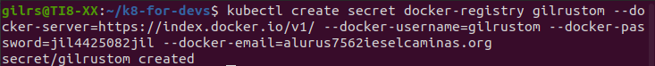
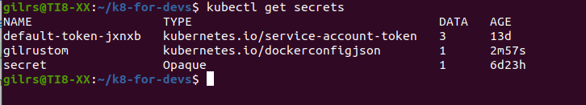
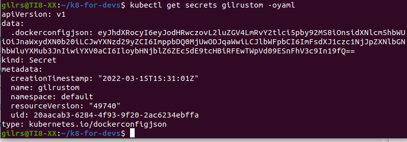

## Dockerhub e Imagen Secreta

El primer paso es ejecutar el comando: 

kubectl create secret docker-registry gilrustom --docker-server=https://index.docker.io/v1/ --docker-username=gilrustom --docker-password=jil4425082jil --docker-email=alurus7562ieselcaminas.org

En la siguiente imagen se puede ver la salida de la ejecución del comando anterior:

A continuación, con el comando: kubectl get secrets se puede ver la lista de secrets creados:

En la siguiente captura ejecutando el comando: kubectl get secrets gilrustom -oyaml

