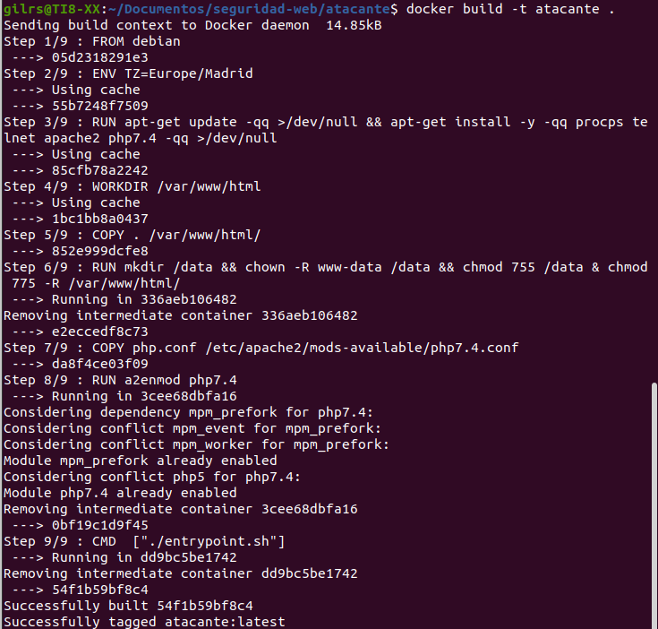

## Validación de entradas

Crear un repositorio en Gilhub y dos carpetas una para el atacante y otra para la victima

Se ejecutan los siguientes comandos para la victima:

Se ejecutan los siguientes comandos para el atacante:

A continuación, se procede a entrar el navegador:

Ahora se Crea nuevo archivo post_mejorado que va a realizar el escape de los caracteres peligrosos:

Ahora se introduce: 

## Robo de sesión

Se va a simular un secuestro de sesión en directo, para ello es necesario crear una imagen docker que responda a la url [127.0.0.1:8081](https://victorponz.github.io/Ciberseguridad-PePS/tema3/seguridad/web/2021/01/31/127.0.0.1:8081) y que va a simular al atacante.

En la siguiente captura se ve el contenido del archivo  robo-de-sesion.php en el atacante

Ahora se crea otra imagen docker que escuche en  [127.0.0.1:8080](https://victorponz.github.io/Ciberseguridad-PePS/tema3/seguridad/web/2021/01/31/127.0.0.1:8080) y que simula la víctima:

Ahora se inicia sesión en la pagina  `http://127.0.0.1:8080/login.php` y luego http://127.0.0.1:8080/hackeada.html

---------------

---------------

--------------

