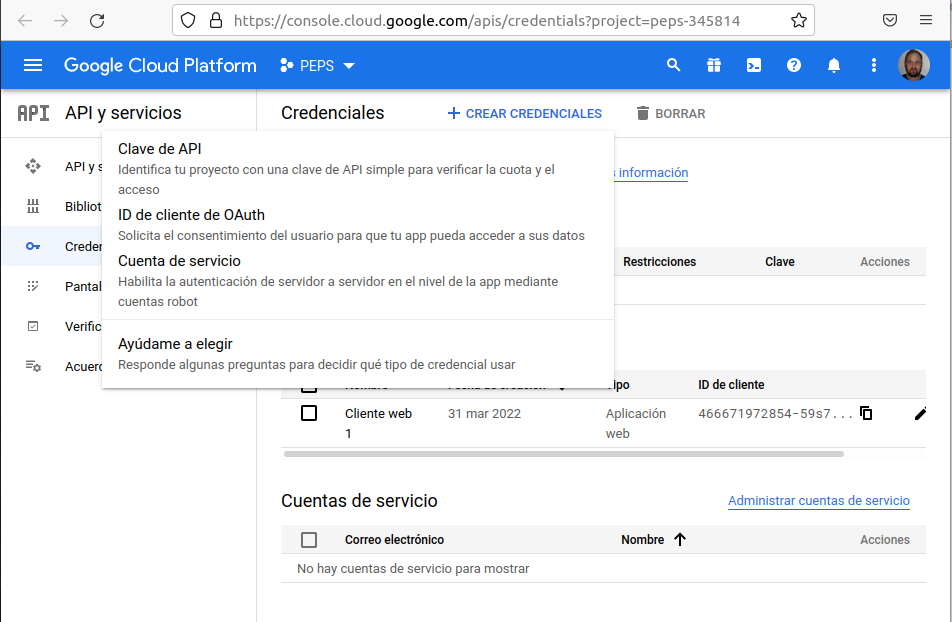
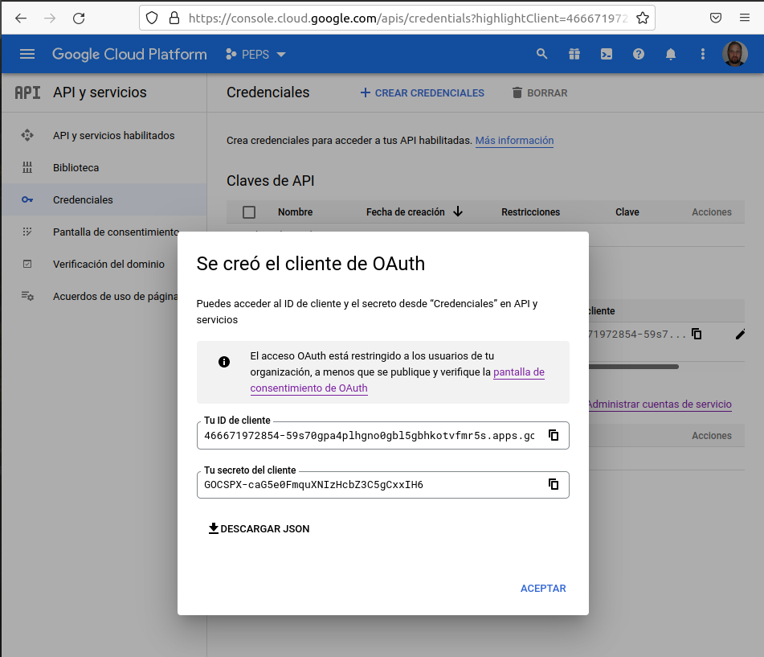
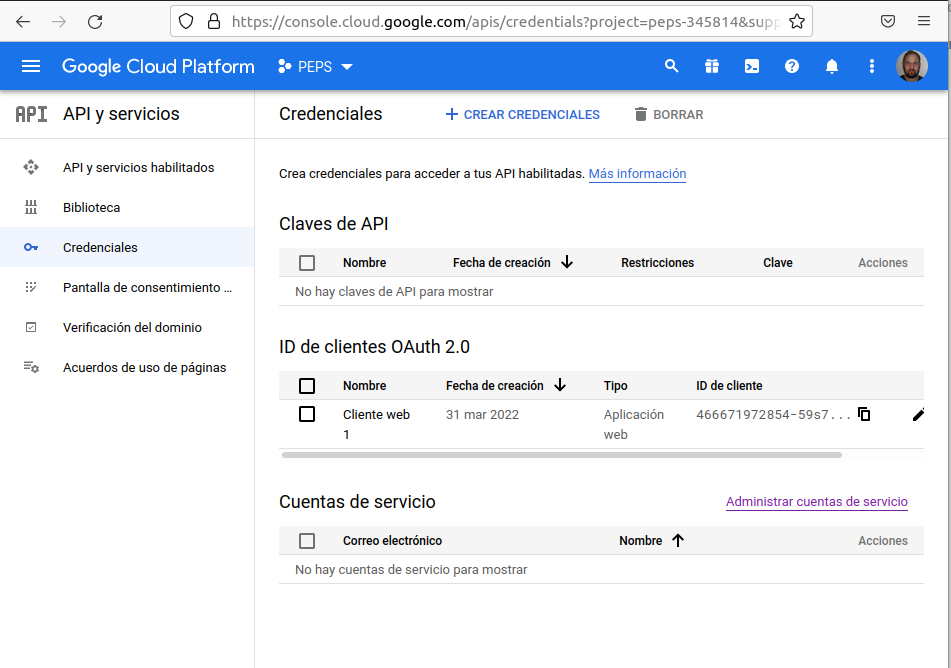
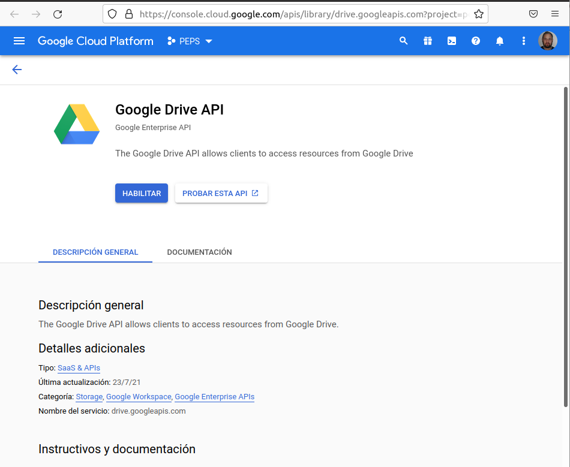
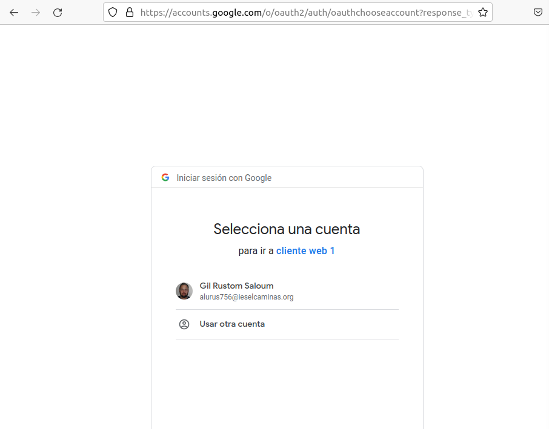
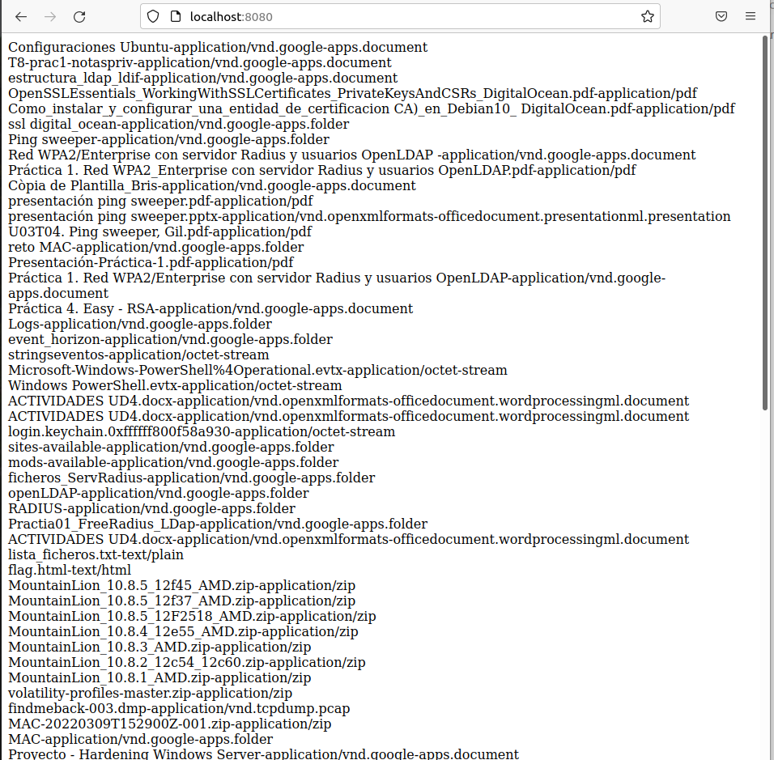

## Autenticación OAuth0

- Crear la aplicación

Se procede a crear una aplicación web que use la autorización OAuth de Google.

Se crea primero credenciales:

A continuación, se puede ver que ya se ha creado el cliente:

Ahora se procede a habilitar el API del drive:

Ahora pedirá los credenciales de google para continuar:

A continuación, se mostrara el contenido del drive:

