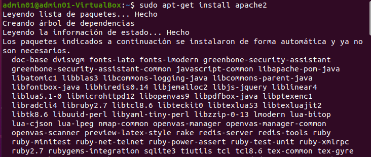
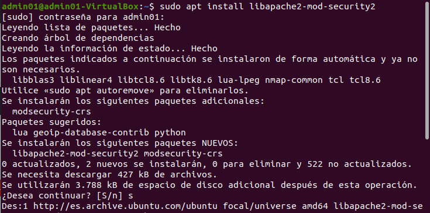
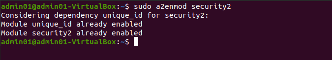
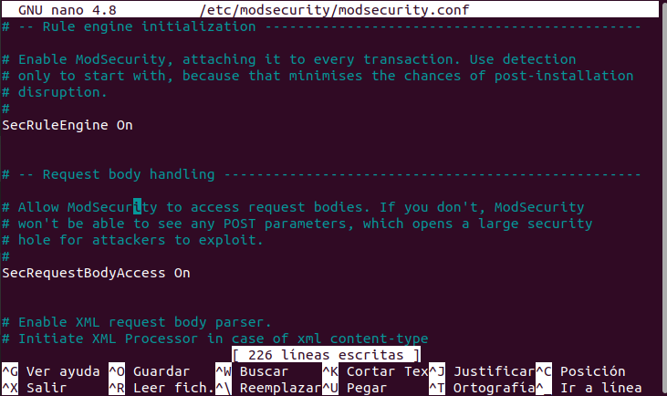

## Hardering 2

- Configurar la instalación de apache para que se optenga las reglas de mod_security

El primer paso es instalar el apache2:

Ahora se instala libapache2-mod-security2:

Habilitar el modulo instalado:

Ahora se edita el fichero modsecurity y se modifica la siguiente linea:

De esta forma se ha conseguido configurar la instalación de apache para que se optenga las reglas de mod_security.

