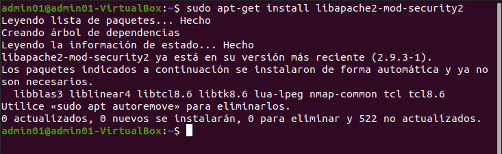
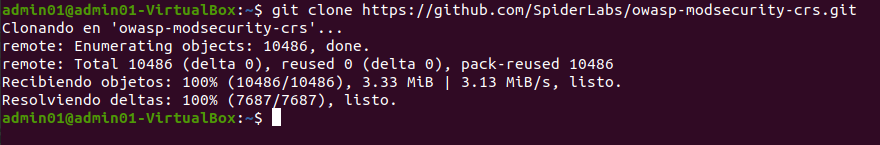
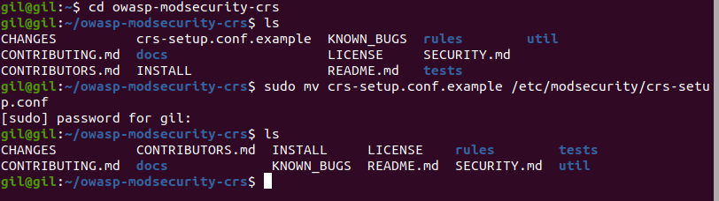
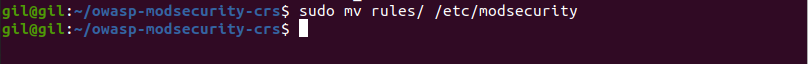
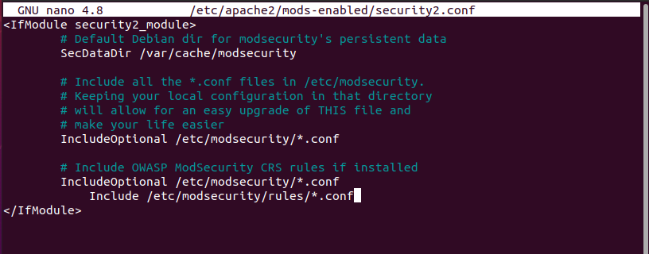
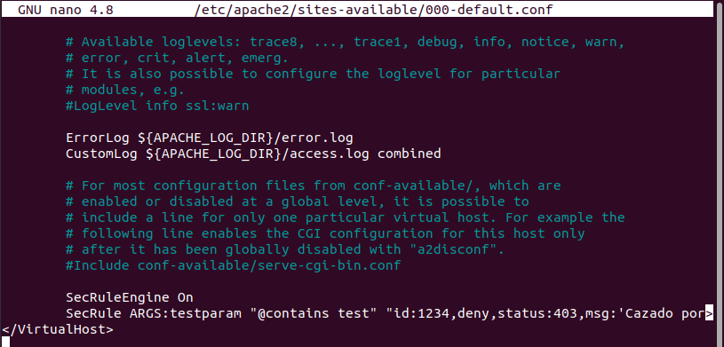

## Hardering 3

- Realizar la instalación de apache en la que se incluyan las reglas OWASP para  mod_security.

1. Instalar libapache2-mod-security2

   

2. Se realiza el clonado del siguiente repositorio con los contenidos para tenerlo en el equipo:

   

3. Se accede a la carpeta owasp-modsecurity-crs para mover el archivo crs setup.conf.example:

   

4. A continuación, se procede a mover las reglas al directorio modsecurity:

   

5. Se comprueba que en el archivo security2.conf se cargan las reglas:

   

6. Se comprueba el correcto funcionamiento, para ello se edita el fichero de configuración del host virtual y se añaden las reglas:

   

7. Se prueba el comando curl localhost/index.html?testparam=test y la respuesta será:

   ```
   <!DOCTYPE HTML PUBLIC "-//IETF//DTD HTML 2.0//EN"> <html><head> <title>403 Forbidden</title> </head><body> <h1>Forbidden</h1> <p>You don't have permission to access this resource.</p> </body></html>
   ```

