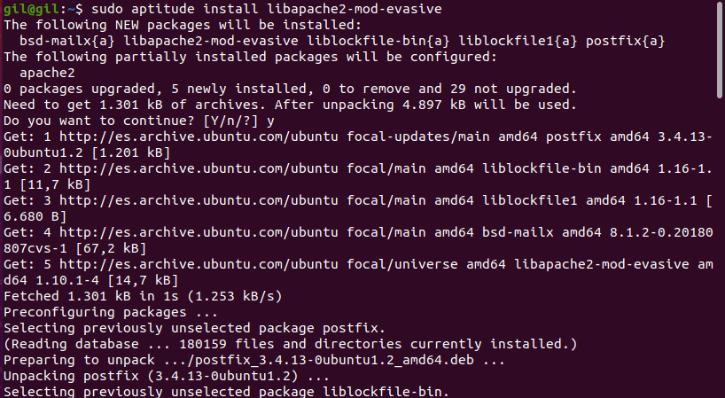
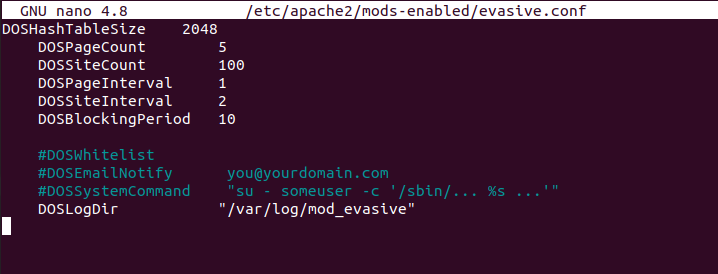
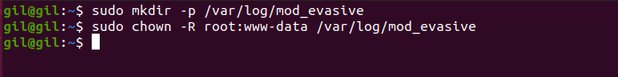
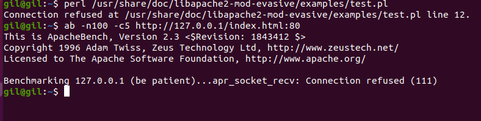
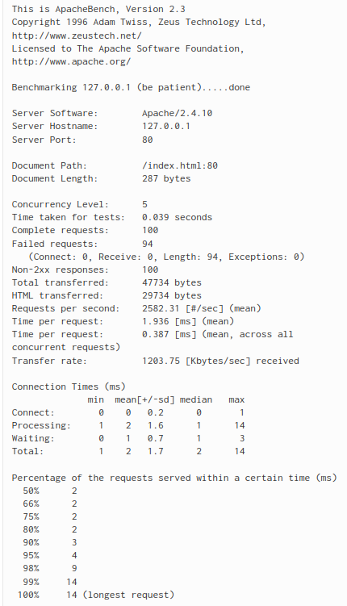

## Hardering 4

## Instalación y configuración de módulo Mod_Evasive Servidor Web (Apache)

Para ello se sigue los siguientes pasos:

- Instalación de dependencias

- Configuración del módulo Mod_Evasive

Para ello se edita el fichero de configuración:

Se crea el directorio de los logs:

Ahora se realiza el test y un apachebench:

No se ha podido realizar el test ya que es debido a un fallo repentino en el servicio apache2, se ha intentado reinstalar el servicio pero se sigue dando el mismo error.

En el caso de que el servicio funcionara bien debe dar lo siguiente:

---------------------------------------

---------------------------

