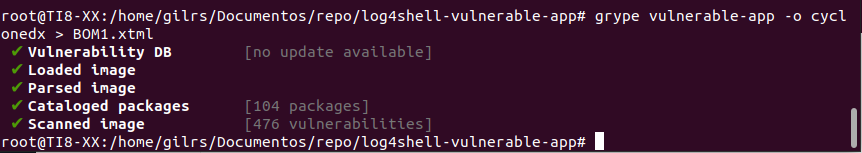

## Escaneo pasivo de vulnerabilidades

Un escáner de seguridad de contenedores ayudará a encontrar todas las  vulnerabilidades dentro de los contenedores y a monitorearlas  regularmente contra cualquier ataque.

## Uno de los escaneos es trivy para realizarlo se sigue los siguientes pasos:

- Se descarga un repositorio de ejemplo que contiene vulnerabilidades:

  

- Se crea la imagen:

  

- Se pone en marcha el docker:

  

- Se procede a instalar trivy:

  

​       

- A continuación, se procede a realizar el escaneo, para ello se ejecuta el comando 

  trivy image vulnerable-app:

  

## Testeo de una imagen de Wordpress

- Se descarga una imagen de Wordpress:

  

  

  - Se escanea la imagen:

  

- Se realiza un testeo con DependencyTrack a partir del BOM generado con syft:

  Se instala syft:

  

​       Se Genera el BOM con el formato cyclonedx:

- Se realiza un testeo con DependencyTrack a partir del BOM generado con grype:

  Se instala grype:  

​        Se Genera el BOM con el formato cyclonedx:        

---

---

---

