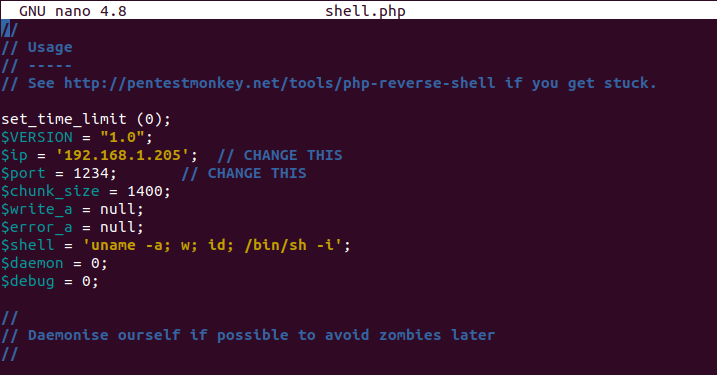
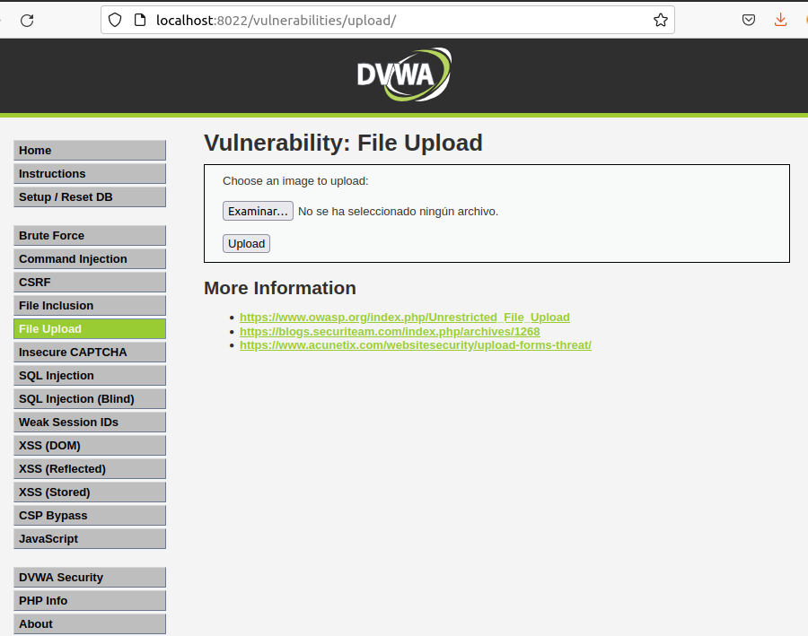
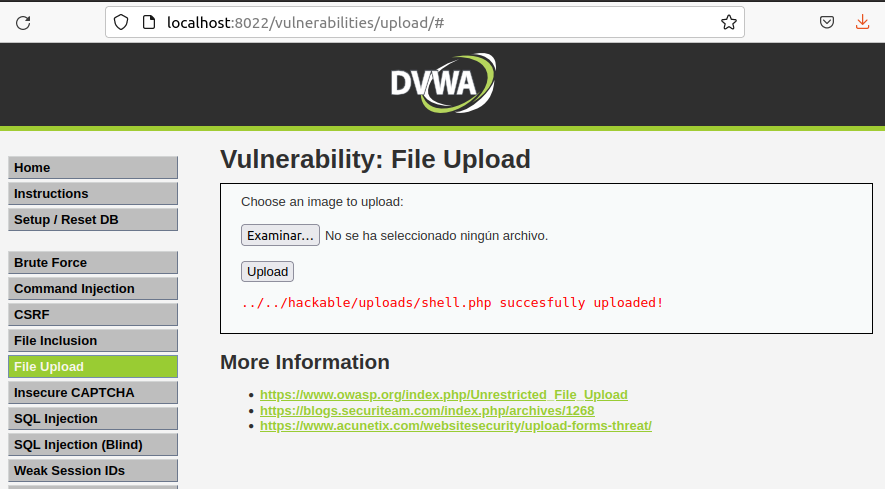
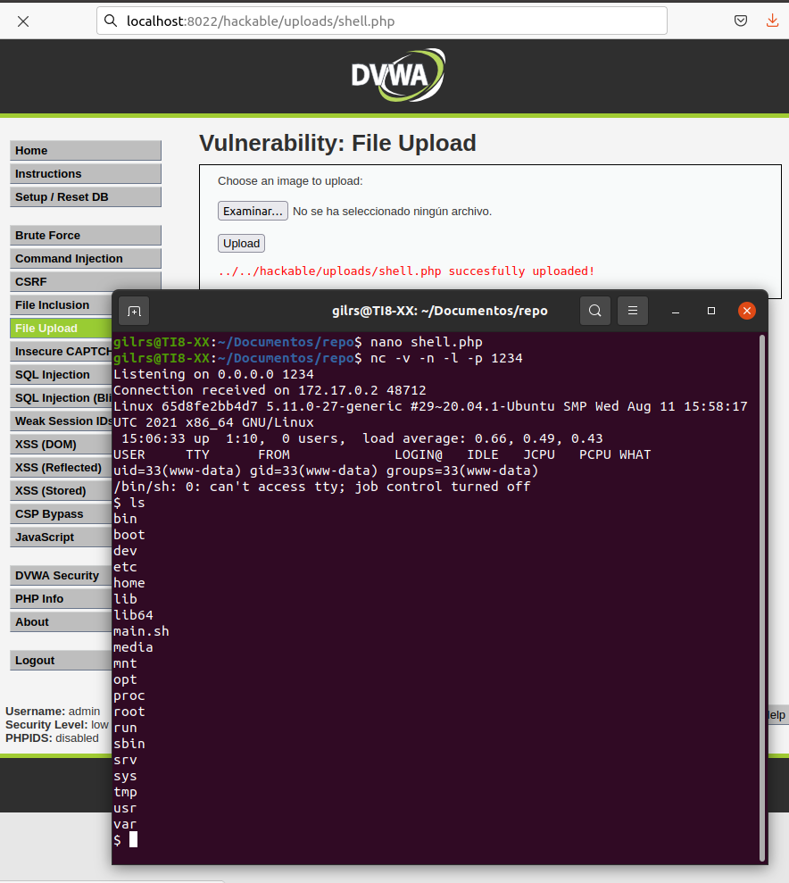

## File Upload

Se va a realizar un reverse shell, para ello se va a subir un archivo ejecutable para que el ordenador de la víctima se conecte al ordenador del supuesto atacante al visitar una url. Para realizar el reverse shell se va a seguir los siguientes pasos:

Paso 1:

Se crea un archivo shell.php con el siguiente contenido:

Paso 2:

A continuación, se sube el archivo shell.php creado en el paso anterior al menú upload:

Paso 3:

Ahora se procede a ejecutar el comando netcat: nc -v -n -l -p 1234

-------------

------------

-------------

