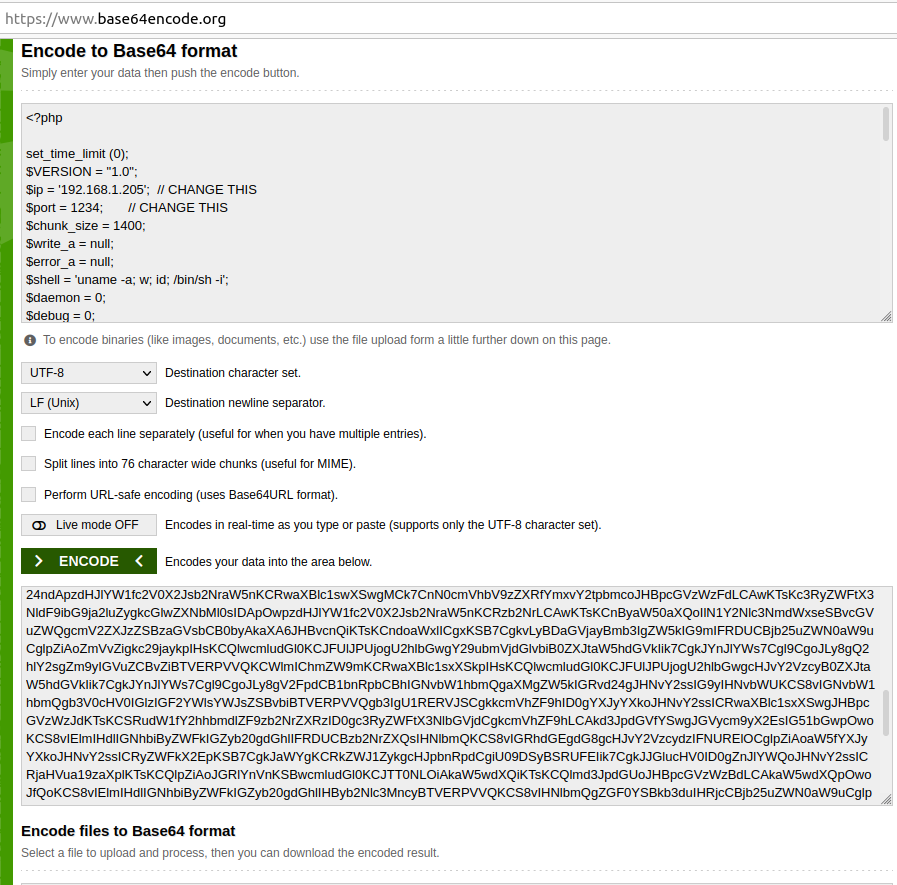
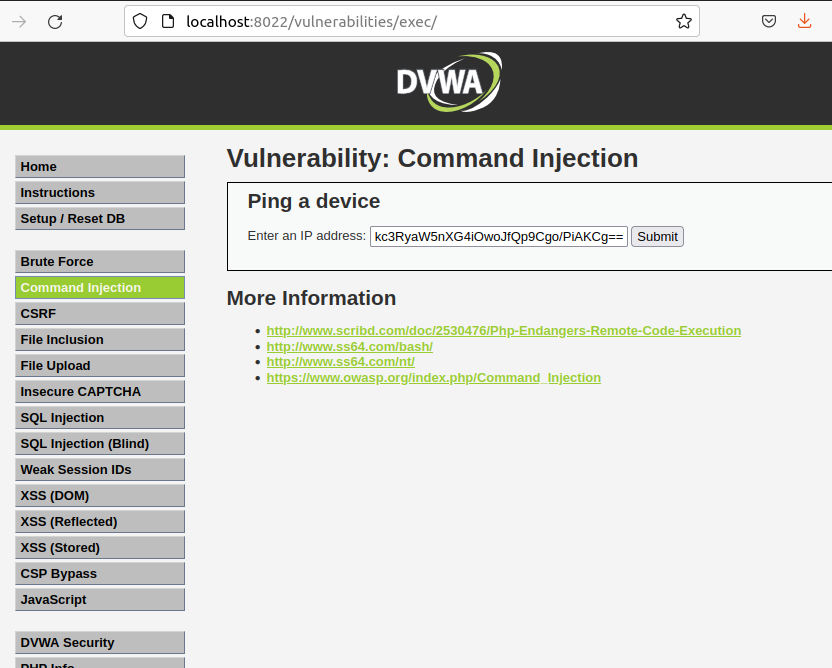
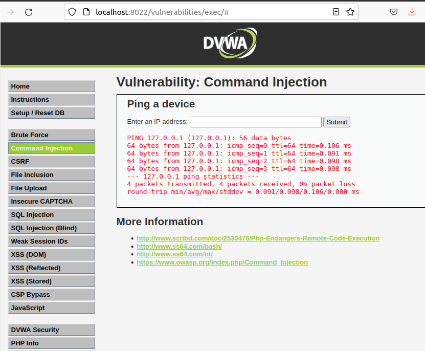
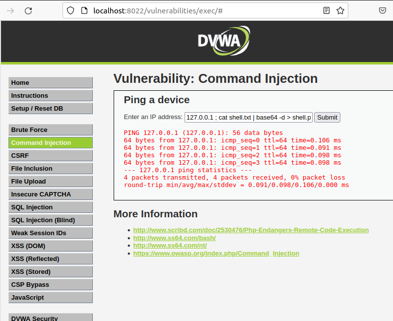
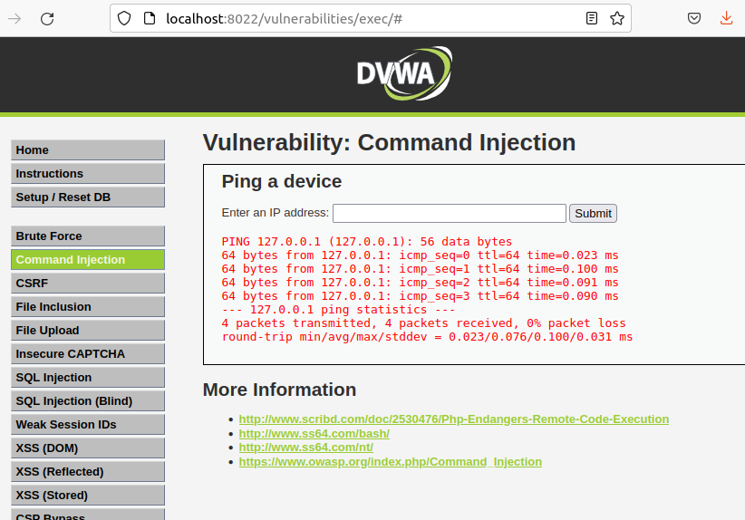
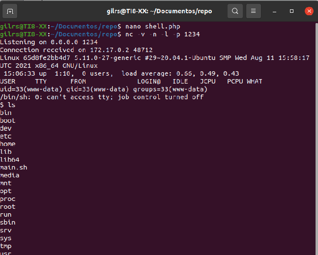

## Command Injection

Se va a realizar un reverse shell mediante la inyección  de comandos desde un campo de texto de un formulario que no realiza una validación de entrada correcta.

Paso 1: 

Se crea un archivo shell.php con el siguiente contenido:

Paso 2:

Se procede a codificar el archivo shell.php en base 64:

Paso 3:

Se aprovecha de la vulnerabilidad para crear un archivo en el servidor mediante la siguiente entrada en el formulario:

en la imagen anterior se puede decir que se ha creado el archivo `shell.txt` con el código en base64.

Ahora con el comando 127.0.0.1 ; cat shell.txt | base64 -d > shell.php se descodifica el código:

Paso 4:

Ahora solo queda ejecutar el comando netcat en el ordenador atacante:

---

---

---

