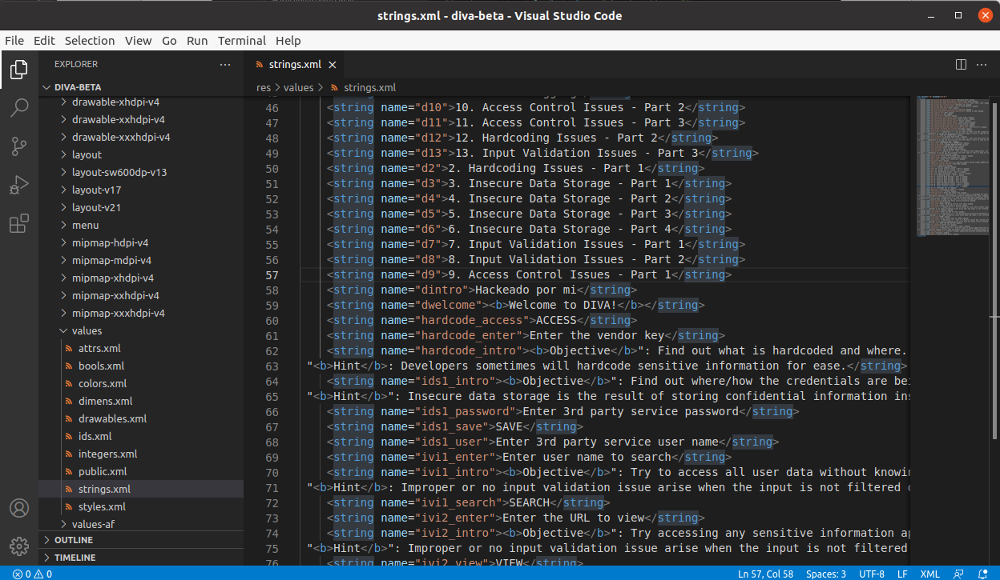

## Ingeniería Inversa en Android

Se va a utilizar la aplicación DIVA, para ello se instala el emulador:

```
adb install DivaApplication.apk
```


Hay que renombrar el archivo y ejecutar el siguiente comando:

```
sh d2j-dex2jar.sh ../DivaApplication.apk
```


Para lanzar el programa,  se ejecuta:

```
java -jar jd-gui-1.6.6.jar 
```


Se va a contentar con modificar el mensaje de bienvenida que está localizado en el archivo `res/values/strings.xml` modificando la clave `<string name="dintro">`



Sólo queda volver a compilar la aplicación y a firmarla. Primero se compila:


Y ahora se firma se usa la aplicación [uber-apk-signer](https://github.com/patrickfav/uber-apk-signer). Descar el [jar](https://github.com/patrickfav/uber-apk-signer/releases/tag/v1.2.1) y ejecutar:


Ahora se genera el archivo `DivaModificada-aligned-debugSigned.apk. Ahora desinstalar la versión antigua:


Se  instala la hackeada:


----

----

----

---

