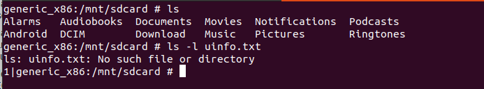

### Actividad Diva

## Challenge 1: “1. Insecure logging”

Se ejecuta el comando adb logcat y al mismo tiempo en insecure logging se procede a insertar un numero de tarjeta:

Y luego se mira en logactivity.class:

## Challenge 2: “2. Hardcoding issues – part 1”

En la aplicación Android se accede a hardcoding issues part1 y se introduce un codigo de seguridad:

Ahora se mira en el archivo hardcodeactivity.class:

# Challenge 3: “3. INSECURE DATA STORAGE – PART 1”

El objetivo es averiguar dónde se almacenan los datos ingresados por el usuario y también el código que los hace vulnerables.

Se ingresa algunos datos en los campos de texto de edición de la aplicación:

Ahora se busca el archivo donde almacena la clave que hemos introducido:

# Challenge 4: “4. INSECURE DATA STORAGE – PART 2”

El objetivo es averiguar dónde se almacenan los datos ingresados por el usuario y también el código que los hace vulnerables.

Ingresar algunos datos en los campos de edición de texto de la aplicación como se muestra arriba. Al igual que el desafío anterior.

Ahora, veamos dónde se almacenan estos datos.

Pasemos al sistema de archivos del emulador. Obtenga un shell usando adb y navegar hasta el directorio de la aplicación.

# Challenge 5: “5. INSECURE DATA STORAGE – PART 3”

El objetivo es averiguar dónde se almacenan los datos ingresados por el usuario y también el código que los hace vulnerables.

Ingresar algunos datos en los campos de texto de edición de la aplicación:

Ahora, veamos dónde se almacenan estos datos.

Pasemos al sistema de archivos del emulador. Obtenga un shell usando adb y navegar hasta el directorio de la aplicación.

# Challenge 6: “6. INSECURE DATA STORAGE – PART 4”

El objetivo es averiguar dónde se almacenan los datos ingresados por el usuario y también el código que los hace vulnerables.

Ingresar algunos datos en los campos de texto de edición de la aplicación:

Ahora, veamos dónde se almacenan estos datos.

Pasemos al sistema de archivos del emulador. Obtenga un shell usando adb y navegar hasta el directorio de la aplicación.

Al final dice que no hay ese archivo pero tiene que sacar un texto con la contraseña introducida.

# Challenge 7: “7. INPUT VALIDATION ISSUES – PART 1”

Si se conoce el nombre de usuario, puede acceder a los datos asociados a él. Pero, el objetivo es acceder a todos los datos sin conocer ningún nombre de usuario.

Pongamos una comilla simple (') y veamos cómo responde la aplicación.

¡Parece que no hay respuesta! Mirando la salida de logcat, encontré la siguiente entrada de registro:

¡Buenas noticias! Posible inyección SQL. El error anterior muestra que las consultas SQL dinámicas se utilizan para obtener datos de SQLite db y la comilla simple que pasamos está causando un error de SQL debido a las comillas simples que no coinciden.

Agreguemos otra comilla simple y veamos cómo responde la aplicación.

¡Perfecto! Esto confirma la inyección de SQL. Un número impar de comillas simples está causando errores de SQL. Cuando las comillas coinciden correctamente, la consulta SQL se ejecuta correctamente.

Usemos una cadena que siempre devuelva verdadero para obtener las entradas de la base de datos. Podemos usar la cadena 1′ or ‘1’ != ‘2

